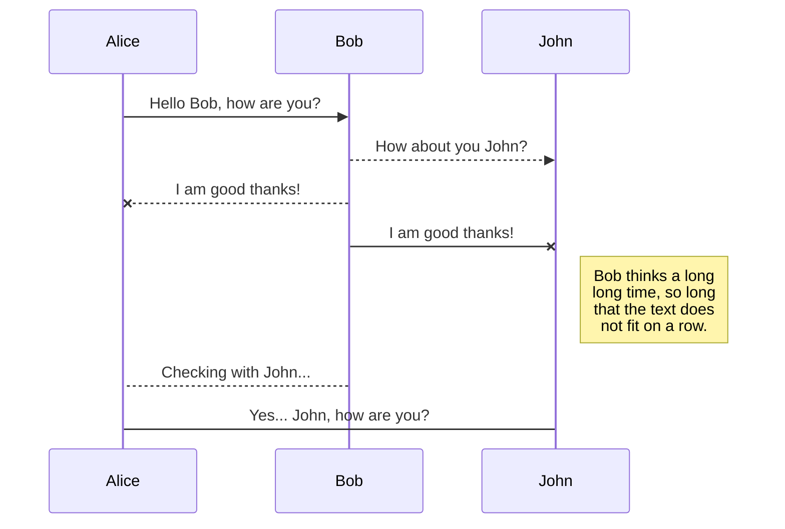
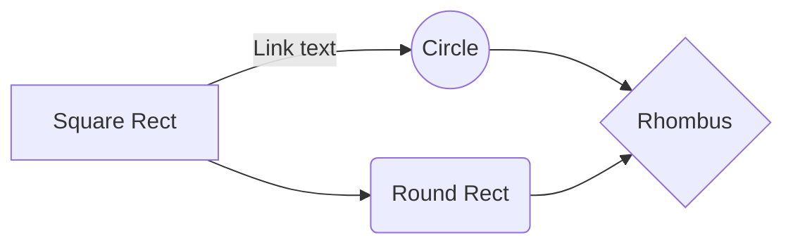

 # ExecutionPolicy.. Very Important!!!
 Set-ExecutionPolicy -Scope CurrentUser -ExecutionPolicy Bypass -Force;
 Set-ExecutionPolicy -Scope CurrentUser -ExecutionPolicy Unrestricted -Force;
 Set-ExecutionPolicy RemoteSigned -Scope CurrentUser

 # Setting up Windows

> - if there's no winget then install winget from MSStore
>   `winget -v`
>   `winget install git.git`
>   `winget install Microsoft.WindowsTerminal`
> - open Terminal as Admin
> - install Visual C++ from https://aka.ms/vs/17/release/vc_redist.x64.exe
> - download and install TouchCursor from:

https://github.com/martin-stone/touchcursor/releases/download/v1.7.1/TouchCursorSetup-1.7.1.exe

> delete the existing setting file:
> `Get-ChildItem -Path $env:AppData\TouchCursor -Include *.* -File -Recurse | foreach { $_.Delete()}`

> clone TCSettings from Github and put it in the right directory:
> `git clone https://github.com/ShamelJij/TCSettings.git $env:AppData\touchcursor`

> create start folder.. by default it is c:\start
> `New-Item -Path 'c:\start' -ItemType Directory`

> create nvim folder.. by default it is $env:AppData\nvim
> `New-Item -Path '$env:AppData\nvim' -ItemType Directory`

> create new environment variable for myStart
> `[Environment]::SetEnvironmentVariable('myStart','c:\start', 'Machine')`

> install scoop
> `iex "& {$(irm get.scoop.sh)} -RunAsAdmin`
> `scoop install curl sudo`

> create new local for Powershell Profile Folder

> `$profileFolder = ($PROFILE -replace ".{33}$")`

> - install node manually
> - install python 3.11 manually from MSStore

> - clone poshell from Github and set it to $Profilefolder

> `git clone -b daapc https://github.com/ShamelJij/poshell.git . -outfile $Profilefolder`

> - installing powershell modules for icons and git
> `install-module posh-git`
> `install-module terminal-Icons`
> - download Nerd-fonts CascadiaCode

> `Invoke-WebRequest -Uri "https://github.com/ryanoasis/nerd-fonts/releases/download/v3.0.2/CascadiaCode.zip" -Outfile $env:userprofile\Downloads\nerdfonts.zip`

> - extract Nerd-fonts

> `Expand-Archive -LiteralPath $env:userprofile\Downloads\nerdfonts.zip -DestinationPath $env:userprofile\Downloads\nerdfonts`

> - install the fonts manually by activating all fonts in the folder and right click then install
> - remove existing terminal profile
> - install my terminal profile

> `git clone https://github.com/ShamelJij/terminalSettings.git'$env:LOCALAPPDATA\Packages\Microsoft.WindowsTerminal_8wekyb3d8bbwe\LocalState`

> - install VSCode

> `winget install microsoft.visualstudiocode`

> - installing neovim

> `scoop install neovim gcc`
> `npm install -g neovim`

> - install vim-plug on windows

> ```
> iwr -useb https://raw.githubusercontent.com/junegunn/vim-plug/master/plug.vim |` ni "$(@($env:XDG_DATA_HOME, $env:LOCALAPPDATA)[$null -eq $env:XDG_DATA_HOME])/nvim-data/site/autoload/plug.vim" -Force
> ```
> `Install-Module -Name psreadline -Force`

> - Installing treeSitter

> `npm install -g pyright vscode-langservers-extracted typescript typescript-language-server`


## Test

SmartyPants converts ASCII punctuation characters into "smart" typographic punctuation HTML entities. For example:

|                |ASCII                          |HTML                         |
|----------------|-------------------------------|-----------------------------|
|Single backticks|`'Isn't this fun?'`            |'Isn't this fun?'            |
|Quotes          |`"Isn't this fun?"`            |"Isn't this fun?"            |
|Dashes          |`-- is en-dash, --- is em-dash`|-- is en-dash, --- is em-dash|


## KaTeX

You can render LaTeX mathematical expressions using [KaTeX](https://khan.github.io/KaTeX/):

The *Gamma function* satisfying $\Gamma(n) = (n-1)!\quad\forall n\in\mathbb N$ is via the Euler integral

$$
\Gamma(z) = \int_0^\infty t^{z-1}e^{-t}dt\,.
$$

> You can find more information about **LaTeX** mathematical expressions [here](http://meta.math.stackexchange.com/questions/5020/mathjax-basic-tutorial-and-quick-reference).


## UML diagrams

You can render UML diagrams using [Mermaid](https://mermaidjs.github.io/). For example, this will produce a sequence diagram:



And this will produce a flow chart:


